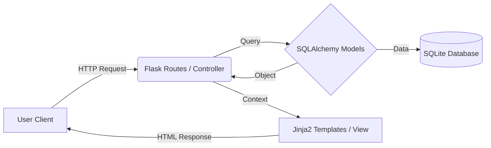

# 🍔 FlowState | Restaurant Management System

> **A comprehensive, full-stack restaurant operations platform engineered for efficiency, real-time tracking, and seamless user experience.**


<p align="center">
  
</p>

## 📋 Table of Contents
- [About The Project](#-about-the-project)
- [Vibe Coding & AI Workflow](#-vibe-coding--ai-workflow)
- [System Architecture](#-system-architecture)
- [Technical Stack](#-technical-stack)
- [Database Schema](#-database-schema)
- [Key Features](#-key-features)
- [Getting Started](#-getting-started)
- [Screenshots](#-screenshots)

---

## 📖 About The Project

**FlowState** is a software engineering solution designed to replace fragmented manual restaurant processes with a centralized digital workflow. The system bridges the communication gap between **Customers**, **Kitchen Staff (Admins)**, and **Delivery Drivers**.

Developed using the **"Vibe Coding" methodology**, the project prioritizes fluid user interaction, minimizing friction from order placement to final delivery. It features a responsive design with a dedicated Dark Mode to enhance usability in low-light environments (e.g., for drivers at night).

---

## ⚡ Vibe Coding & AI Workflow

This project adopts a modern **Vibe Coding** methodology, focusing on high-level architectural flow while leveraging AI for rapid implementation.

The development was orchestrated using **Integrafty**, utilizing a **Multi-Agent System** approach to ensure code quality and optimization:

* **🤖 Claude 3.5 Sonnet:** Utilized for complex backend logic, architectural structuring, and refactoring (MVC Pattern enforcement).
* **✨ Gemini 1.5 Pro:** Deployed for creative frontend solutions, documentation generation, and error debugging.
* **🚀 Integrafty Platform:** Served as the central orchestration hub, enabling seamless context sharing between agents to maintain the "Flow State."

> *This workflow allowed for a 100% focus on business logic and user experience, reducing boilerplate coding time by approx. 70%.*

---

## 🏗 System Architecture

The project follows the **Model-View-Controller (MVC)** architectural pattern to ensure code modularity and maintainability:

* **Model:** Powered by **SQLAlchemy ORM** to manage database interactions and relationships between Users, Orders, and Menu Items.
* **View:** Server-side rendering using **Jinja2 Templates**, enhanced with vanilla JavaScript for dynamic frontend interactions (Cart management).
* **Controller:** **Flask Routes** handle business logic, request processing, and routing between the frontend and backend.



---

## 💻 Technical Stack

This project was built using a robust, industry-standard Python web stack.

### 🔌 Backend (Core Logic)

| Technology | Purpose |
|------------|---------|
| Python 3.10+ | The primary programming language. |
| Flask | A lightweight WSGI web application framework. |
| Flask-SQLAlchemy | ORM extension for database interactions (Abstracts raw SQL). |
| Flask-Login | Manages user sessions, cookie handling, and access control (ACL). |
| Flask-WTF | Handles secure form rendering and CSRF (Cross-Site Request Forgery) protection. |
| Email-Validator | Ensures data integrity for user registration. |
| Werkzeug Security | Handles password hashing (Scrypt) for secure storage. |

### 🎨 Frontend (User Interface)

| Technology | Purpose |
|------------|---------|
| HTML5 / Jinja2 | Structure and server-side dynamic content rendering. |
| CSS3 (Custom) | Styled using CSS Variables for robust Dark/Light Mode theming. |
| JavaScript (ES6) | Handles client-side interactivity (AJAX cart updates, UI toggles). |
| Bootstrap Icons | Lightweight vector icons for UI elements. |

### 🗄️ Database

**Engine:** SQLite (Relational Database Management System).

**Why SQLite?** Selected for its serverless, zero-configuration architecture, making it ideal for rapid prototyping and local deployment without the overhead of a dedicated database server.

---

## 📊 Database Schema

The system utilizes a relational schema with the following key entities:

* **User Model:** Stores credentials and roles (Admin, Customer, Driver).
* **MenuItem Model:** Stores food details, pricing, categories, and image references.
* **Order Model:** The core transaction entity linking Users (Customers & Drivers) to MenuItems.
  * Relationships: One-to-Many with User (Customer), One-to-Many with User (Driver).
* **SystemConfig:** A Key-Value store for dynamic settings (e.g., Delivery Fee, Site Name) manageable via the Admin Panel.

---

## 🌟 Key Features

### 1. Role-Based Access Control (RBAC)
* **Admin:** Full CRUD capabilities for the Menu, Real-time Order Management (Accept/Cook/Ready), and System Settings.
* **Customer:** Browse menu, Add to Cart (Session-based), Place Orders, Track Order History.
* **Driver:** Specialized dashboard to view "Ready" orders, Accept delivery, and update status to "Delivered".

### 2. Smart Cart System
A persistent shopping cart that calculates totals, taxes, and delivery fees dynamically before checkout.

### 3. Workflow Automation
Automated status transitions: Pending ➝ In Progress ➝ On The Way ➝ Delivered.

---

## 🚀 Getting Started

Follow these instructions to set up the project locally.

### Prerequisites
* Python 3.8 or higher installed.

### Installation

1. **Clone the repository**
```bash
git clone https://github.com/YOUR_USERNAME/FlowState-Order-Management-System.git
cd FlowState-Order-Management-System
```

2. **Create a Virtual Environment**
```bash
python -m venv venv
# Windows:
.\venv\Scripts\activate
# Mac/Linux:
source venv/bin/activate
```

3. **Install Dependencies**
```bash
pip install -r requirements.txt
```

4. **Run the Application**

*Note: The database will be created and seeded automatically on the first run.*

```bash
python app.py
```

5. **Access the App**

Open `http://127.0.0.1:5000` in your browser.

### 🔐 Default Credentials

| Role | Email | Password |
|------|-------|----------|
| Admin | admin@app.com | admin123 |
| Driver | driver@app.com | driver123 |

---

## 📸 Screenshots

### Admin Dashboard
*Coming soon*

### Dark Mode Interface
*Coming soon*

---

## 👨‍💻 Author

**Mohamed Nouman**  
*Software Engineer*

GitHub: [@Mohamed-3M-Nouman](https://github.com/Mohamed-3M-Nouman)
