# 🍔 FlowState | Restaurant Management System

> **A comprehensive, full-stack restaurant operations platform engineered for efficiency, real-time tracking, and seamless user experience.**


<p align="center">
  
</p>

## 📋 Table of Contents
- [About The Project](#-about-the-project)
- [System Architecture](#-system-architecture)
- [Technical Stack](#-technical-stack)
- [Vibe Coding Workflow](#-vibe-coding--ai-workflow)
- [Use Case Diagram](#-use-case-diagram)
- [Getting Started](#-getting-started)
- [Screenshots](#-screenshots)

---

## 📖 About The Project

**FlowState** is a software engineering solution designed to replace fragmented manual restaurant processes with a centralized digital workflow. The system bridges the communication gap between **Customers**, **Kitchen Staff (Admins)**, and **Delivery Drivers**.

It features a responsive design with a dedicated Dark Mode to enhance usability in low-light environments.

---

## 🏗 System Architecture

The project follows the **Model-View-Controller (MVC)** architectural pattern:
* **Model:** SQLAlchemy ORM for database interactions.
* **View:** Jinja2 Templates with dynamic JavaScript updates.
* **Controller:** Flask Routes handling business logic.


---

## 💻 Technical Stack

| Category | Technologies |
|----------|-------------|
| Backend | Python 3.10, Flask, Flask-Login, Flask-SQLAlchemy |
| Frontend | HTML5, CSS3 (Variables), JavaScript, Jinja2 |
| Database | SQLite (Serverless & Lightweight) |
| Security | Werkzeug (Scrypt Hashing), CSRF Protection |

---

## ⚡ Vibe Coding & AI Workflow

This project adopts a modern **Vibe Coding** methodology. The development was orchestrated using **Integrafty** with a **Multi-Agent System** approach:

* **🤖 Claude 3.5 Sonnet:** Backend logic, architectural structuring, and MVC enforcement.
* **✨ Gemini 1.5 Pro:** Frontend creativity, documentation, and debugging.
* **🚀 Integrafty:** Central orchestration hub to maintain the "Flow State."

> *This workflow allowed for a 100% focus on business logic, reducing boilerplate coding time by approx. 70%.*

---

## 📍 Use Case Diagram

```mermaid
graph TB
    subgraph Actors
        C[👤 Customer]
        A[👨‍🍳 Admin]
        D[🚗 Driver]
    end
    
    subgraph "FlowState System"
        UC1[Browse Menu & Order]
        UC2[Manage Menu CRUD]
        UC3[Update Order Status]
        UC4[Deliver Order]
    end
    
    C --> UC1
    A --> UC2
    A --> UC3
    D --> UC4
```



---

## 🚀 Getting Started

**Clone the Repo:**
```bash
git clone https://github.com/YOUR_USERNAME/FlowState-Order-Management-System.git
```

**Install Requirements:**
```bash
pip install -r requirements.txt
```

**Run App:**
```bash
python app.py
```

**Login Credentials:**
- Admin: `admin@app.com` / `admin123`
- Driver: `driver@app.com` / `driver123`

---

## 📸 Screenshots

### Login Page
<p align="center">
  
</p>

### User Profile
<p align="center">
  
</p>

### Main Menu (Light)
<p align="center">
  
</p>

### Menu (Dark Mode)
<p align="center">
  
</p>

---

## 👨‍💻 Author

**Mohamed Nouman**

GitHub: [@Mohamed-3M-Nouman](https://github.com/Mohamed-3M-Nouman)
